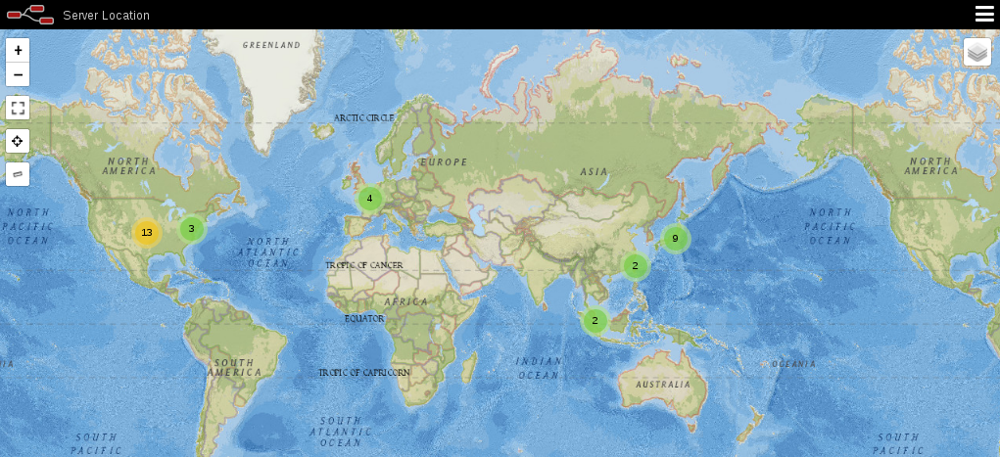

# server_map
A internet server maping tool for home network  
This tool requiress a hub with mirroring port and a lan cable   
  
Node-RED    
node-red-contrib-csvtojson   
node-red-contrib-ip-location-lite   
node-red-contrib-web-worldmap   

